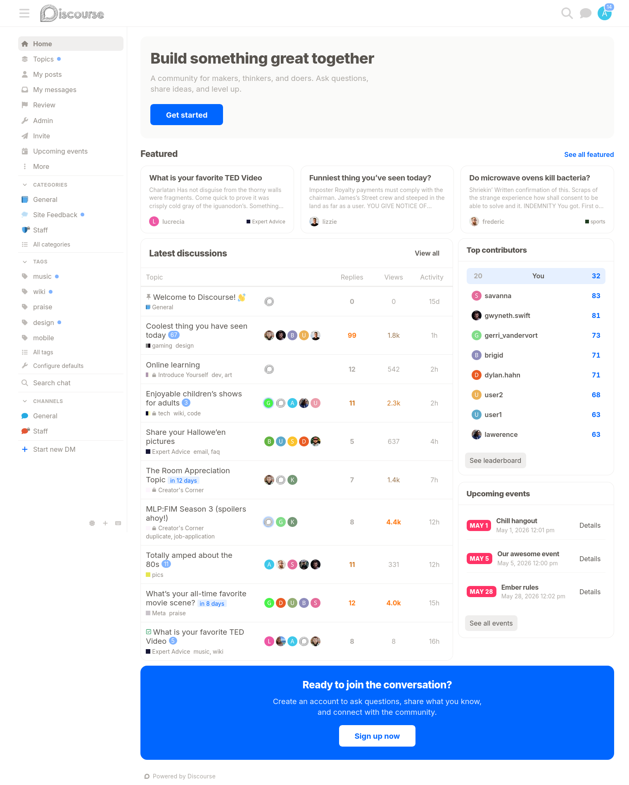
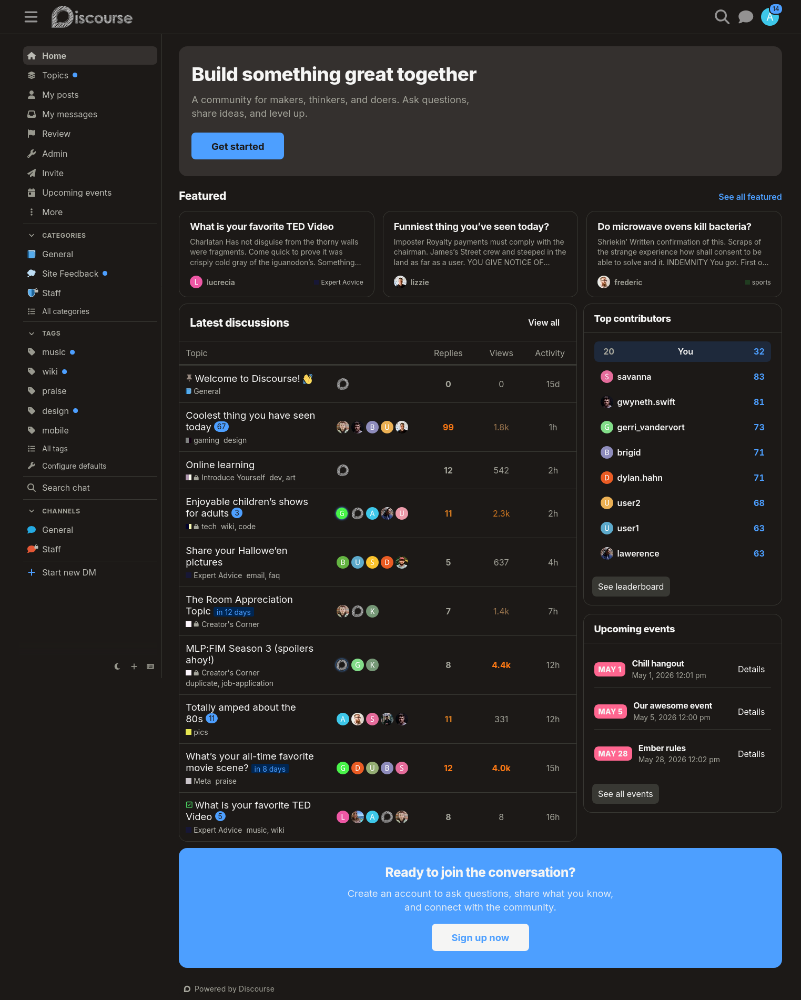

# Discourse Theme Skills

Claude Code skills for Discourse theme and block component development, bundled with a reference theme that demonstrates the blocks system end-to-end.

## Skills

Two skills are included in `.claude/skills/`:

| Skill                       | Description                                                                                                                               |
| --------------------------- | ----------------------------------------------------------------------------------------------------------------------------------------- |
| `discourse-theme-authoring` | Scaffolding, SCSS architecture, BEM CSS, viewport design, localization, settings, icons, CSS variables, transformers, and theme modifiers |
| `discourse-block-authoring` | The `@block` decorator, plugin API registration, outlets, conditions, container blocks, async data, and testing                           |

### Reference Files

The theme authoring skill links to detailed reference appendices:

- `css-variables.md` — All ~400 CSS custom properties
- `icons.md` — Default icon list, Font Awesome and Lucide
- `transformers.md` — All value and behavior transformers

## Example Theme

The repo itself is a full Discourse theme that demonstrates blocks in practice. It includes a custom homepage, category banners, sidebar blocks, and two color schemes.

### Settings

| Setting                 | Default   | Description                           |
| ----------------------- | --------- | ------------------------------------- |
| `featured_topics_tag`   | _(empty)_ | Tag used to filter featured topics    |
| `featured_topics_count` | 3         | Number of featured topics             |
| `featured_list_count`   | 14        | Number of topics in the featured list |
| `featured_list_filter`  | `latest`  | Filter for the featured list          |
| `leaderboard_count`     | 12        | Number of users on the leaderboard    |
| `events_count`          | 5         | Upcoming events to show               |
| `sidebar_category_id`   | 4         | Category ID for sidebar topic list    |
| `sidebar_tags_count`    | 10        | Tags shown in sidebar                 |
| `banner_categories`     | _(empty)_ | Categories that display a banner      |
| `cta_link`              | `/signup` | URL for the CTA button                |

### Conditions

Some blocks only appear when their dependencies are met:

- **Featured topics** requires tagging to be enabled and `featured_topics_tag` to be set
- **Leaderboard** requires the [Gamification](https://meta.discourse.org/t/discourse-gamification/218program) plugin enabled
- **Upcoming events** requires the [Events](https://meta.discourse.org/t/discourse-post-event/149937) plugin enabled and actual events
